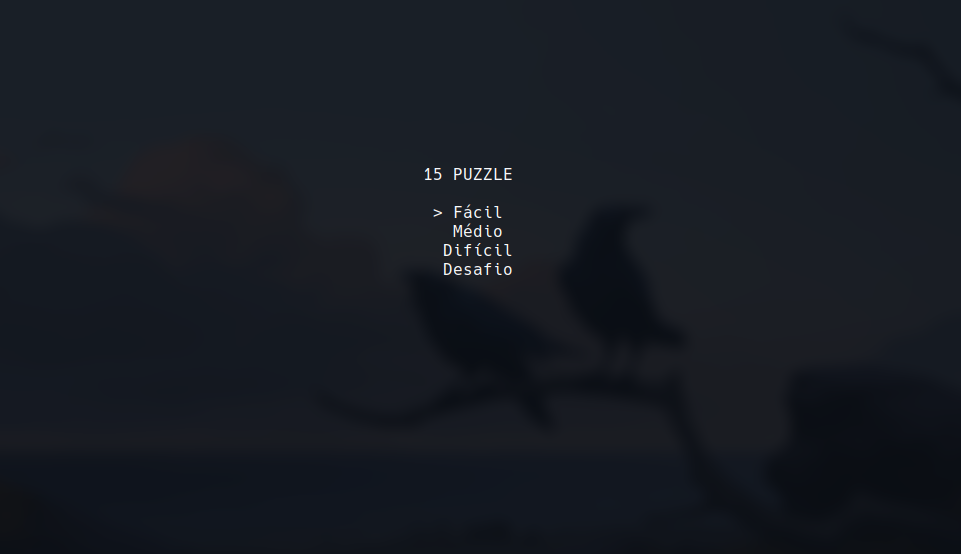
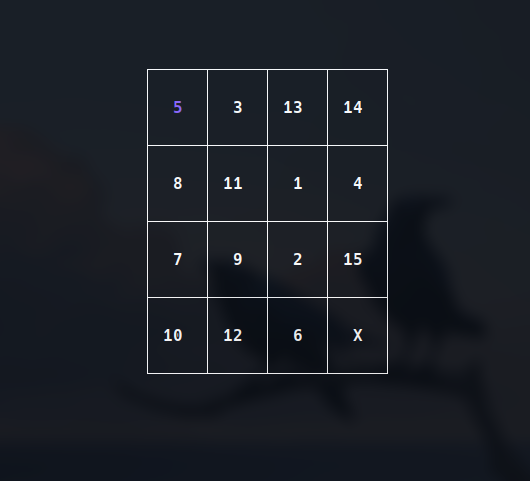
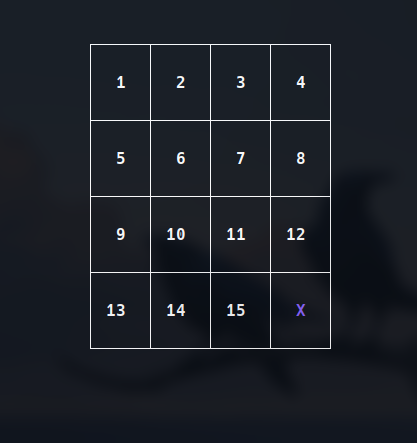

# 15 PUZZLE

- **Númera da Lista** 19
- **Conteúdo da Disciplina** Dividir e Conquistar

## Alunos

| Matrúcula | Aluno |
| --        | --    |
| 211063069 | Breno Queiroz Lima |

## Sobre

Projeto é um jogo 15 Puzzle. O objetivo do jogo é ordenar os quadrados de forma crescente.
O jogo gerado sempre é solucionável, graças a uma etapa de verificação que utiliza o algoritmo
de contagem de inversões.

## Screenshots

## Instalação

- **Linguagem**: Go
- **Framework/Bibliotecas**: Bubbletea

## Uso

| Teclas | Ações |
| :-     | :-
|Setas ou h,j,k,l| Movimenta o cursor|
|Barra de espaço | Confirma ação     |
|Esc ou q| Volta para o menu         |
|Ctrl+c | Finaliza o jogo            |

## Outros

### Referência citada no vídeo

> [How to check if an instance of 15 puzzle is solvable](https://www.geeksforgeeks.org/check-instance-15-puzzle-solvable/)
